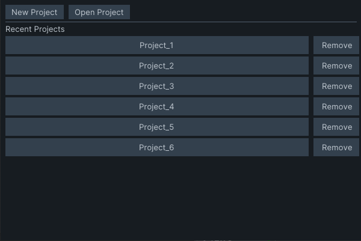
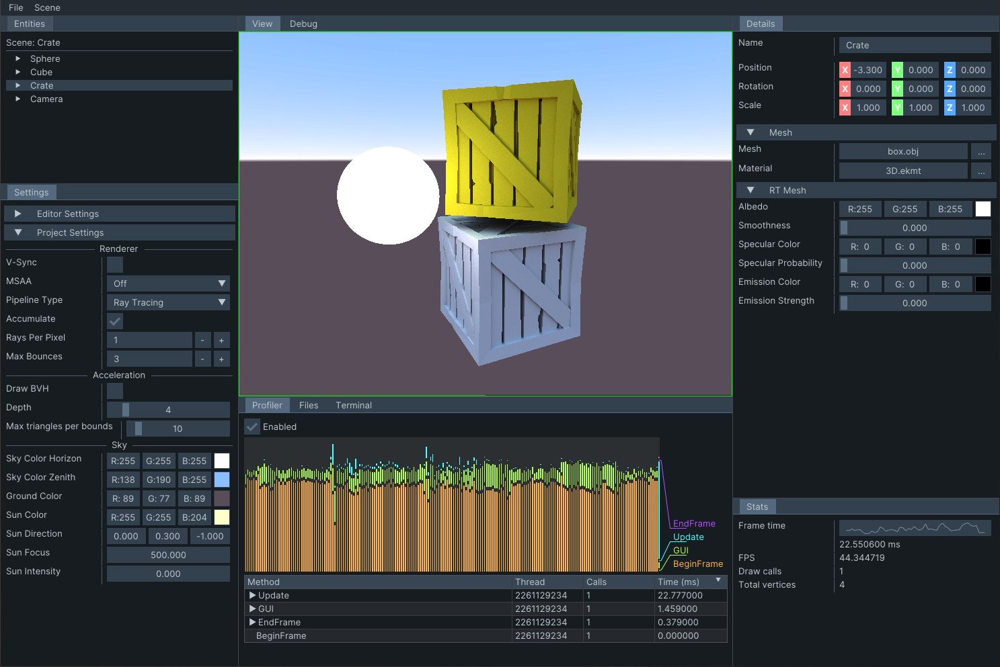
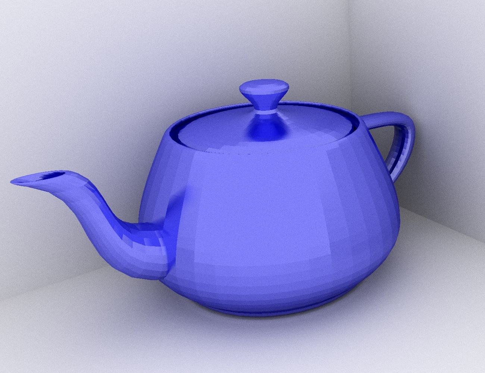
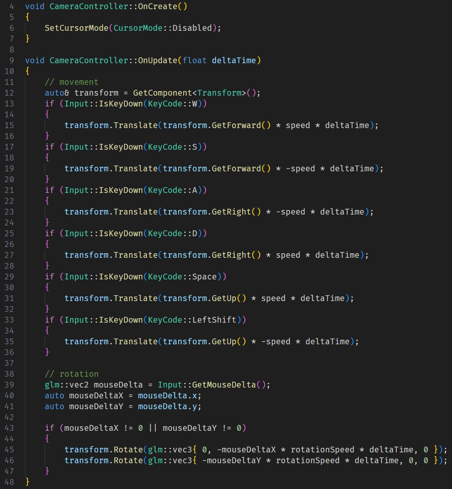
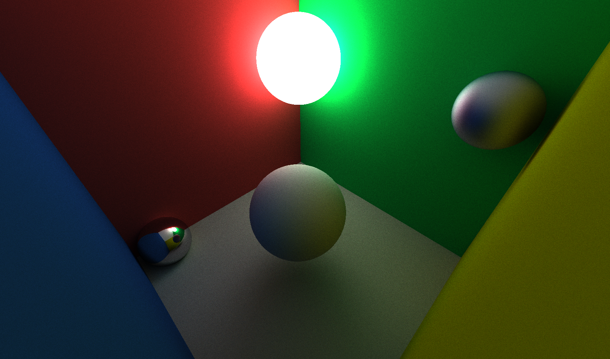

# Eklipse Engine

Eklipse is a game engine which main goal is to provide proof-of-concept solutions to the most important problems of a full fleged game engine (which this engine is not).

## How it works
- **Editor** - allows to import assets, view the scene and scene hierarchy in real-time and export the project to a precompiled executable. Editor supports managing multiple projects.






- **Engine** - uses OpenGL or Vulkan (can switch between them at runtime). Supports simple rasterization pipeline and custom *Ray Tracing* algorithm that uses BVH trees to optimize triangle intersection checks. 





- **Scritps API** - all scripts are written in C++ and provide a simple custom logic injection system. Scripts are a part of a separate C++ project that is automatically created with editor project. Creating a new script is as simple as writing new class that derives the base *Script* class. All scripts are compiled into a shared library that is then linked to a given executable (Editor or Runtime). 





- **Runtime** - editor can build every project as a standalone app. Runtime is the precompiled executable that links to engine library, scripts API library and project library containing all scripts. It copies all the assets from editor project and loads them as raw files (no binary archive).



## Disclaimer ⚠

This engine has been written in Visual Studio 2022 on Windows and this is the only target setup that is supported for now.

## How to build

1. Clone the repo with all of it's submodules using:

```git clone --recursive https://github.com/tomtar00/Eklipse.git```

2. Go to Eklipse directory

```cd Eklipse```

3. Go to `Eklipse\vendor\_projects\spirv_tools` and uncomment the `prebuildcommands` section of the `spirv_tools.lua` file.

```cd Eklipse\vendor\_projects\spirv_tools```

```cpp
prebuildcommands
{
    get_gen_core_tables_cmd("unified1"),
    get_gen_enum_string_mapping_cmd("unified1"),
    get_gen_opencl_tables_cmd("unified1"),
    get_gen_glsl_tables_cmd("unified1"),

    get_gen_vendor_table_cmd("debuginfo", ""),
    get_gen_vendor_table_cmd("opencl.debuginfo.100", "CLDEBUG100_"),
    get_gen_vendor_table_cmd("nonsemantic.shader.debuginfo.100", "SHDEBUG100_"),
    get_gen_vendor_table_cmd("spv-amd-gcn-shader", ""),
    get_gen_vendor_table_cmd("spv-amd-shader-ballot", ""),
    get_gen_vendor_table_cmd("spv-amd-shader-explicit-vertex-parameter", ""),
    get_gen_vendor_table_cmd("spv-amd-shader-trinary-minmax", ""),
    get_gen_vendor_table_cmd("nonsemantic.clspvreflection", ""),

    get_gen_registry_file_cmd(),
    get_gen_build_version_cmd()
}
```

This guarantees that the additional source files are genereted for SPIRV. **After the first build of SPIRV comment out this section again to prevent the compiler from recompiling the SPIRV library on every build.**

4. Go to `Eklipse\vendor\_projects\glslang` and uncomment the `prebuildcommands` section of the `glslang.lua` file.

```cpp
prebuildcommands
{
    "cd " .. glslang .. "&& python3 build_info.py ./ -i build_info.h.tmpl -o glslang/build_info.h",
    "cd " .. glslang .. "&& python3 gen_extension_headers.py -i ./glslang/ExtensionHeaders -o ./glslang/glsl_intrinsic_header.h"
}
```

Again, **after the first build of glslang comment out this section again to prevent the compiler from recompiling the glslang library on every build.**

5. Create project files using [premake5](https://premake.github.io/download/)

```premake5 vs2022```

6. In Visual Studio 2022 press `F5` to compile the editor. The `prebuildcommands` from premake scripts will try to run `python3` scripts on your machine. For that to work, make sure that you have installed [python](https://www.python.org/downloads/).

## Credits

- [GLFW](https://github.com/glfw/glfw)
- [GLM](https://github.com/g-truc/glm.git)
- [Dear ImGui](https://github.com/ocornut/imgui.git)
- [entt](https://github.com/skypjack/entt)
- [spdlog](https://github.com/gabime/spdlog.git)
- [GLAD](https://glad.dav1d.de/)
- [VulkanSDK](https://www.lunarg.com/vulkan-sdk/)
- [Vulkan Memory Allocator](https://github.com/GPUOpen-LibrariesAndSDKs/VulkanMemoryAllocator)
- [yaml-cpp](https://github.com/jbeder/yaml-cpp.git)
- [nativefiledialog](https://github.com/mlabbe/nativefiledialog.git)
- [ImGuizmo](https://github.com/CedricGuillemet/ImGuizmo.git)
- [glslang](https://github.com/KhronosGroup/glslang.git)
- [SPIRV-Tools](https://github.com/KhronosGroup/SPIRV-Tools.git)
- [SPIRV-Headers](https://github.com/KhronosGroup/SPIRV-Headers.git)
- [shaderc](https://github.com/google/shaderc.git)
- [filewatch](https://github.com/ThomasMonkman/filewatch)
- [dylib](https://github.com/martin-olivier/dylib)
- [stb_image](https://github.com/nothings/stb)
- [tinyobjloader](https://github.com/tinyobjloader/tinyobjloader)

Huge thanks to [@TheCherno](https://github.com/TheCherno) for creating his [Game Engine Series](https://www.youtube.com/playlist?list=PLlrATfBNZ98dC-V-N3m0Go4deliWHPFwT) on YouTube, which this project is based upon.